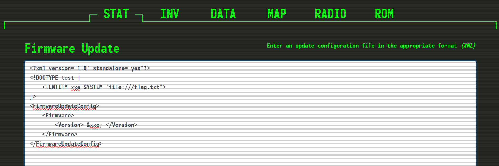

## CTF Journey ##
A journey through CTF

## JAILBREAK ##

Date : 11 May 2025 
Author[s]:
Difficulty : Very easy 

## SYNOPSIS ##
Find flag.txt

## DESCRIPION ##
The crew secures an experimental Pip-Boy from a black market merchant, recognizing its potential to unlock the heavily guarded bunker of Vault 79. Back at their hideout, the hackers and engineers collaborate to jailbreak the device, working meticulously to bypass its sophisticated biometric locks. Using custom firmware and a series of precise modifications, can you bring the device to full operational status in order to pair it with the vault door's access port. The flag is located in /flag.txt

## SOLUTION ##
By opening the given IP address in web, we get a page with "STAT", "INV", "DATA", "MAP", "RADIO", "ROM". 
Pages ~ "STAT", "INV", "DATA", "MAP", "RADIO" tends to show no help with finding flag.txt. 

Under "ROM" , 
Update xml version, XXE payload 

Upon updating this , we get our flag 
